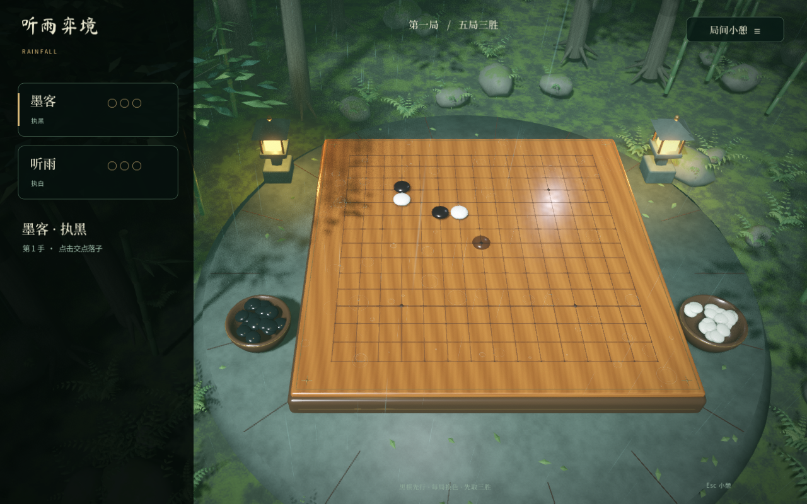
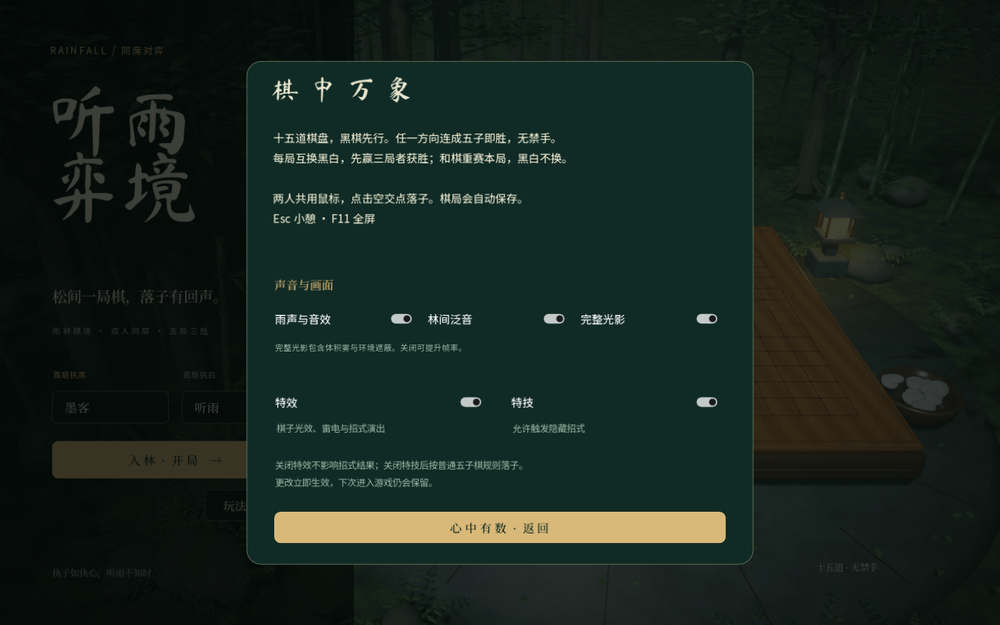
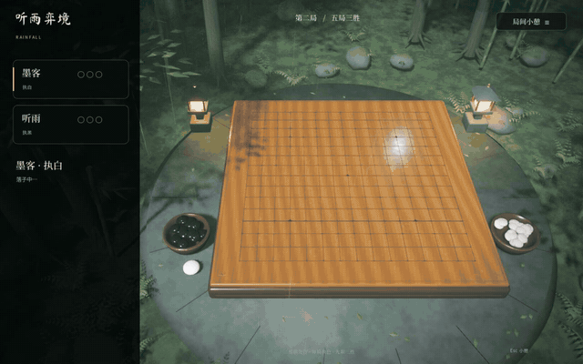
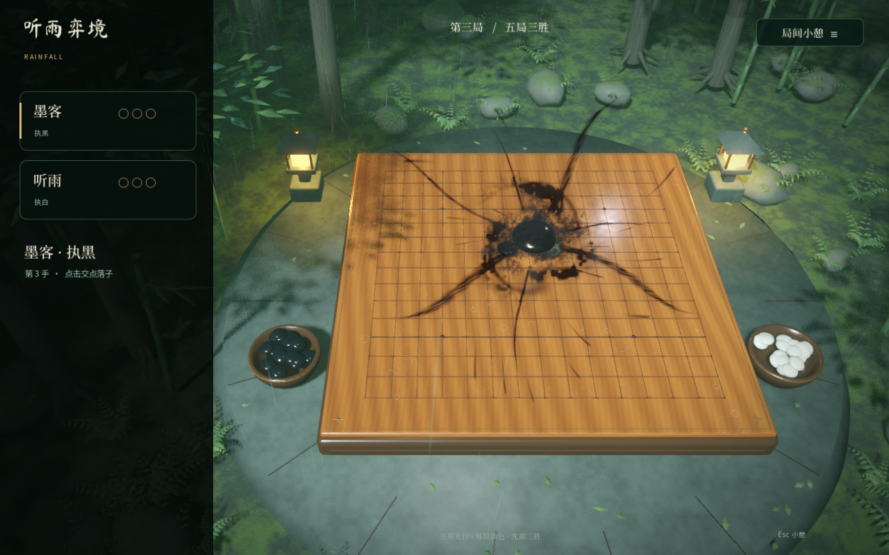

# Skill Gomoku · 听雨弈境

雨落松间，棋起万象。使用 **Godot + Blender** 制作的本地双人 3D 五子棋，包含雨林棋境、黑白棋子专属演出和四种隐藏技法。

当前版本 **2.8.0**。运行与导出已在 **macOS / Apple Silicon、Godot 4.7.2、Forward+ / Metal** 上验证；其他平台尚未验证。两位玩家共用一台电脑和鼠标。



## 快速开始

仓库包含运行所需的模型、字体、纹理与已制作的游戏音频。运行只需要 Godot，**不需要安装 Blender 或 Python**。

```sh
git clone git@github.com:hancao97/Skill-Gomoku.git
cd Skill-Gomoku

# macOS 默认安装位置；也可改为自己的 Godot 可执行文件路径。
GODOT_BIN=/Applications/Godot.app/Contents/MacOS/Godot
"$GODOT_BIN" --editor --path .
```

首次打开会导入资源，完成后按 **F5** 运行。也可以在 Godot 项目管理器中导入仓库根目录的 `project.godot`。完成导入后，直接启动游戏：

```sh
"$GODOT_BIN" --path .
```

## 怎么玩

输入两位玩家的名字，选择「入林 · 开局」。双方轮流点击空交点落子。

- 鼠标移到空交点时，显示当前棋色的**半透明预览棋子**。预览和落下后的棋子共用显示定位，视觉中心对齐吸附交点，落定后位置一致。预览随鼠标立即更新，不额外悬空或上下浮动；移到已有棋子、离开棋盘或打开菜单时隐藏。双方都可使用，关闭特效后仍然保留。
- **15×15 棋盘，黑棋先手**，无禁手；任一方向五子或长连计胜。
- **五局三胜**，每局决出胜负后交换黑白，先得三胜即结束比赛。
- 和棋重赛当前局，保持本局颜色和局数。
- **Esc** 打开小憩菜单；**F11** 切换全屏。
- 每次落子和技能结算都会保存；回到序页可「续上未尽之局」。新开局会替换旧棋局。

## 设置

序页进入「玩法 / 设置」，或在对局中按 Esc 后进入「玩法与设置」。修改立即生效并自动保存。

| 开关 | 作用 |
| --- | --- |
| 雨声与音效 | 控制雨声、触盘声、雷鸣与技能声音。 |
| 林间泛音 | 独立控制背景音乐。 |
| 完整光影 | 控制体积雾和环境遮蔽，可按设备性能调整。 |
| 特效 | 控制棋子光效、雷电震子、蓄力光束和招式演出。关闭时技能仍能改变棋盘并判胜，普通落子与声音设置保留。 |
| 特技 | 控制隐藏技法能否触发。关闭时按普通五子棋规则落子，可独立保留优势方的落子特效。 |

「特效」和「特技」默认开启。关闭开关会清理相关演出或取消当前技能手势，不会回滚棋子与比分。



## 隐藏技法

第一局先落子的玩家永久拥有优势，后续交换黑白也不改变归属。其执黑时呈现墨色烟气，执白时呈现银白光雾；另一位玩家始终为普通落子。界面不标记可发动技能的棋子，也不提示触发方法。

演出主色随当前棋色统一：黑棋使用黑色墨流、弓迹、雷电裂隙与书法；白棋使用银白月轮、闪电与书法。黑子表面仅保留少量中性反光，书法采用细描边保持可读性。

实机演出：[墨黑挽弓](docs/images/bow.png) · [银白月轮](docs/images/moon.png) · [神之一手](docs/images/divine-hand.png)。

第三局开始，优势方普通落子会增加对应棋色的分叉闪电和雷鸣，**对方棋子会被震起、轻微翻动，再落回原来的交点**。震动只改变演出，不改变棋色、棋位或回合。落回声按整组混音，不随棋子数量叠加音量。

2.5.2 将落雷的雷鸣声调低 3 dB，使落子时的声音更柔和。

2.6 重做了三招的声音：挽弓有随拉动变化的绷弦声、破风和短促穿透声；白棋月轮以旋转声汇聚成清亮扩散；天地大同持续聚气，松手后吸气收声，在触盘时重落。正常胜利以短促收势声结束。技能声音保留独立淡出、持续蓄力循环与主输出限幅；详见 [声音设计](AUDIO.md)。

**雷电、震子与技能演出互斥**，大招不会再叠加普通落雷。关闭特效或开始技能时会清理残留演出，将棋子恢复原位。

2.8 重做「神之一手」的手势：119 颗银白棋子沿掌面和指节聚合，配上连续掌缘、指缝、腕线和半透明掌面。参考片尾的送腕、伸指和回腕动作，食指单独展开，另外三指保持微曲，最后下点并散落成 65 个白子交点。空中演出与棋盘手印分别排布，声音按聚子、运指、触盘衔接。



<details>
<summary>展开技法规则与操作（包含隐藏玩法）</summary>

| 技法 | 触发与操作 | 结果 |
| --- | --- | --- |
| 会挽雕弓如满月 | 优势方执黑，三子横向或纵向连续，第四子紧邻中子成 T 形。白棋完整落一手后，下一黑棋回合将侧子向外拉并松手。 | 棋子穿过三连中子，沿直线飞出棋盘。原位变空，路径上的白子和空交点全部填黑，直接赢本局。 |
| 遥遥领先 | 优势方执白，落子形成 2×2 方环或中心四邻的菱形环。 | 四子旋转合为银白月轮，以触发点为中心填满 **5×5 白子**并直接判胜。靠边时向棋盘内平移，始终为完整 25 点。 |
| 天地大同 | 优势方执黑，直接在棋盘空交点按住约 **2 秒**蓄力，松手落下。 | 黑子近景重落，墨色冲击扩散，**225 个交点全部变黑**并直接获胜。 |
| 神之一手 | **仅第二局**，黑棋盒旁出现一颗白子。轮到优势白方时，点击并松开这颗白子。 | 白子聚成指向左下的大手，食指压落；**手形内的黑子和空位全部变白**，范围外保持原样，直接赢本局。 |

T 形支持上下左右四个方向，不接受端点邻子或斜邻子。成形后白棋有完整一手，可以先完成五连获胜；黑棋不能抢射。准备拉弓时也可点击空位正常落子。

天地大同短按仍为普通落子，拖离原点或暂停会取消蓄力。四种技能均只属于优势方，结算只记一次分，演出期间锁住重复输入。

「神之一手」的触发白子保持普通外观，不加高亮或技能提示。黑方不能触发；拖开、暂停或失焦会取消点击。关闭「特技」会隐藏棋盒旁的白子；仅关闭「特效」时仍可发动，直接填成相同白子手形。旧存档可继续使用，第三局起棋盒旁的白子消失。

手势创意来自 2025 年 LG 杯决赛第二局的网络梗：提子放置争议中，卞相壹向裁判投诉，柯洁因累计两次违规被判负。相关事件见 [新华社报道](https://www.news.cn/sports/20250123/8b00659b10b54d4a822c2384337a605a/c.html)。游戏采用玩家指定的优势白方与获胜规则。

天地大同蓄力过程中，黑子逐渐升起、放大，弯曲墨束和细碎拖尾向中心汇聚，周围墨流的范围与浓度持续增强。蓄满后保持待落状态，松手才发动；拖走、切换窗口或打开设置会取消整个手势。



</details>

## 开发与导出

| 工具 | 用途 |
| --- | --- |
| Godot 4.7.2 | 编辑、运行、规则测试及 macOS 导出。 |
| Blender 5.2 LTS | 可选：编辑 `.blend` 源模型或重建模型和纹理。 |
| Python 3.11+、NumPy、FFmpeg | 可选：重制音频和分析实际混音。 |

在 Godot 的「编辑器 → 管理导出模板」中安装与编辑器版本匹配的模板，然后执行：

```sh
mkdir -p builds
"$GODOT_BIN" --headless --editor --path . --import --quit
"$GODOT_BIN" --headless --path . --export-release macOS builds/听雨弈境.app
```

导出预设包含应用图标、资源过滤和 macOS 临时签名。产物位于 `builds/`，不提交到 Git。面向其他电脑分发时，开发者签名与 Apple 公证需使用自己的证书另行配置。

## 验证

完成资源导入后运行：

```sh
# 棋局规则，不需要图形窗口。
"$GODOT_BIN" --headless --path . --script tests/test_rules.gd
"$GODOT_BIN" --headless --path . --script tests/test_divine_hand.gd
"$GODOT_BIN" --headless --path . --script tests/test_hand_gesture.gd

# 真实游戏场景中的输入与演出回放，需要图形环境。
# Dummy 仍经过游戏混音总线，但不向扬声器输出测试声音。
"$GODOT_BIN" --path . --audio-driver Dummy -- --verify --settings-check
"$GODOT_BIN" --path . --audio-driver Dummy -- --verify --feedback-check
"$GODOT_BIN" --path . --audio-driver Dummy -- --verify --hover-check
"$GODOT_BIN" --path . --audio-driver Dummy -- --verify --effect-priority
"$GODOT_BIN" --path . --audio-driver Dummy -- --verify --audio-check
"$GODOT_BIN" --path . --audio-driver Dummy -- --verify --hand-check
```

`--verify` 使用独立内存棋局，不覆盖玩家存档或声音设置；测试目录自动建立。结果、截图和录音写入 `verification/`，不会提交到 Git 或打包进游戏。

`--hover-check` 检查预览中心对齐、即时跟随、实际点击前后轮廓中心一致及隐藏条件，覆盖黑白棋、两种窗口尺寸和棋盘中央与四角，结果写入包含完整补丁版本号的目录（当前为 `verification/v2.8.0/`）。

`tests/test_hand_gesture.gd` 检查 145 个插值姿态的完整轮廓、指头连接、65 次落印及跨帧事件顺序。

`--hand-check` 验证第二局棋盒旁白子的真实鼠标点击、伸指与回腕、轮廓、指尖触盘、手形落盘、双方归属、取消与设置开关，截图和结果写入 `verification/v2.8/`。附加 `--hand-showcase` 可只回放这一招，适用于录制演示。

macOS 后台自动回放可追加 `--isolated-replay`：固定大小的测试窗口保持绘制，忽略桌面真实鼠标与焦点变化，测试脚本仍走游戏输入与控件处理。失焦取消由回放显式触发同一处理函数。普通游戏不受该测试选项影响。

规则、设置、悬浮与震子反馈、技能互斥均有可复现检查。反馈回放对比有无墨流的实际画面，确认蓄力黑色纹理逐级扩展，并覆盖长按超过音效时长后的取消与释放。当前检查数量、结果和声音测量范围见 [验证记录](VERIFICATION.md)；混音设计见 [AUDIO.md](AUDIO.md)。

## 目录

```text
project.godot          Godot 工程入口
main.tscn             主场景
scripts/              规则、输入、设置、场景、音效和技能演出
shaders/              湿木、雨丝、墨烟、银光、雷电与镜头着色器
assets/               游戏运行资源及第三方许可
art/source/           可编辑 Blender 源模型
tools/                模型、音频构建与音频测量工具
tests/                规则测试和实机输入回放
docs/                 实机截图与资源重建说明
builds/               本地导出产物（忽略）
verification/         本地测试产物（忽略）
```

运行直接使用 `assets/models/*.glb`。修改模型或重新制作声音，请看 [资源重建说明](docs/ASSET_BUILD.md)。

## 存档位置

Godot 的 `user://` 目录中包含 `match.json` 和 `settings.cfg`。macOS 默认位置为：

```text
~/Library/Application Support/Godot/app_userdata/听雨弈境/
```

正常更新保留棋局和偏好。旧版配置缺少新增开关时，特效、特技默认开启。

## 素材与署名

- 场景、棋具和植被由本工程的 Blender 模型构建，可编辑源文件随仓库提供。
- 雨声来自 **Félix Blume**，放弦声来自 **Ali_6868**，技能设计元素来自 **DustyWind、AudioPapkin**，均为 CC0；落子与雷鸣采用 **Taira Komori（小森平）** 录音，遵循作者允许的游戏内嵌使用条款。来源、加工方式与许可见 [音频说明](assets/licenses/audio-v2.txt)。原始音效下载不作为独立素材库随仓库分发。
- Noto Sans SC、Noto Serif SC、Ma Shan Zheng 字体附带 [OFL](assets/fonts/OFL.txt) 与 [Ma Shan Zheng OFL](assets/fonts/MaShanZheng-OFL.txt)。
- 四幅特技书法由内置图像生成工具制作，最终贴图路径与提示词记录见 [ASSETS_V2.md](ASSETS_V2.md)。

第三方素材遵循各自许可；仓库中的声音用于本游戏，不得提取后作为独立音效库再发布。
